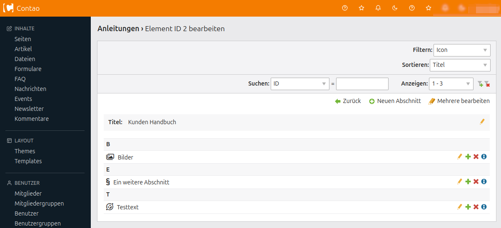

# UserGuide




## Beschreibung

**UserGuide** ist eine Erweiterung für das Open Source CMS [Contao](https://contao.org), die es Administratoren ermöglicht, hilfreiche Anleitungen direkt im Backend bereitzustellen. Die Inhalte können in Kategorien organisiert, übersichtlich gegliedert und optisch mit Icons versehen werden – ideal für Teams, Redakteure oder Kunden.

Ob kurze Hilfetexte oder umfassende Schritt-für-Schritt-Erklärungen: Mit UserGuide wird die Contao-Installation selbsterklärend.


## Autor

**NetGroup GmbH**
Entwicklung: Patrick Froch
Kontakt: <info@netgroup.de>


## Voraussetzungen

- PHP: ^8.2
- Contao: ^4.13 oder ^5.0


## Installation

Die Erweiterung kann bequem über den **Contao Manager** installiert werden. Einfach nach `netgroup/userguide` suchen.

Alternativ via Composer:

```bash
composer require netgroup/userguide
```


## Verwendung

Eine Anleitung besteht aus mehreren **Abschnitten**, die in der Contao-typischen Benutzeroberfläche verwaltet werden können. Jeder Abschnitt ist ein eigenständiger Text, der in **[Markdown](https://docs.github.com/de/get-started/writing-on-github/getting-started-with-writing-and-formatting-on-github/basic-writing-and-formatting-syntax)** verfasst wird. Zusätzlich können **InsertTags** verwendet werden – etwa um Bilder oder Links dynamisch einzufügen.

### Icons

Zur besseren Orientierung lassen sich **Icons** aus der Sammlung [Font Awesome Free](https://fontawesome.com/download) für einzelne Abschnitte auswählen.

### Kategorien

Abschnitten kann eine **Kategorie** zugewiesen werden, die pro Anleitung individuell definieren werden können. So ist auch bei vielen Inhalten ein optimaler Überblick gewährleistet und es kann gezielt filtert werden.

### Bearbeitung sperren

Einzelne Anleitungen oder Abschnitte lassen sich zur Sicherung vor ungewollten Änderungen **sperren**. Sie sind dann weiterhin sichtbar, aber nicht mehr bearbeitbar.

> ⚠️ **Hinweis:** Die Sperrung kann nur direkt über die Datenbank aufgehoben werden.

Dies ist sinnvoll, wenn man Anleitungen weitergeben will, diese aber nicht bearbeitet werden sollen.


## Mitwirken

Beiträge sind herzlich willkommen!
Bitte erstellen Sie bei größeren Änderungen zunächst ein Issue, um die geplanten Anpassungen zu besprechen.

Pull Requests sollten mit entsprechenden Tests ergänzt werden.


## Tests

Tests können mit folgendem Skript im Wurzelverzeichnis der Erweiterung ausgeführt werden:

```bash
./build/runtests.sh
```


## Getestete Versionen

Die Erweiterung wurde erfolgreich mit folgenden Kombinationen aus PHP und Contao getestet:


| Contao                                                                            |  |  |  |
|-----------------------------------------------------------------------------------|---------------------------------------------------------------------------|---------------------------------------------------------------------------|---------------------------------------------------------------------------|
|  | x                                                                         | x                                                                         | x                                                                         |
|    | x                                                                         | x                                                                         | x                                                                         |
|    | x                                                                         | x                                                                         | x                                                                         |
|    | x                                                                         | x                                                                         | x                                                                         |
|    | x                                                                         | x                                                                         | x                                                                         |
|    | x                                                                         | x                                                                         | x                                                                         |
|    | x                                                                         | x                                                                         | x                                                                         |


## Lizenz

Dieses Projekt steht unter der [Apache 2.0 Lizenz](https://choosealicense.com/licenses/apache-2.0/).